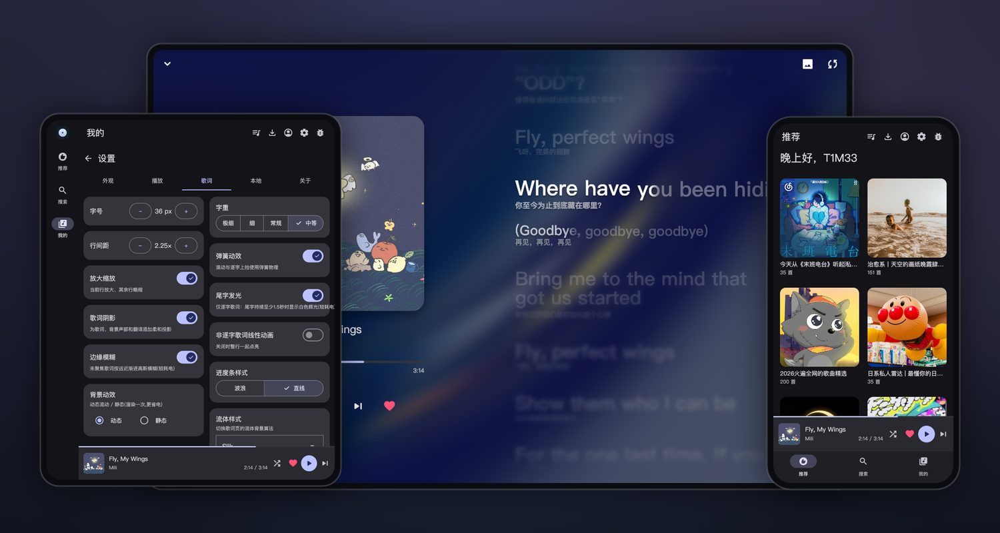

<p align="center">
  
</p>

<h1 align="center">QPlayer</h1>

<p align="center">
  <a href="README.md">简体中文</a> · <b>English</b>
</p>

<p align="center">
  <b>An extensible cross-platform music player with a QML-rendered UI</b><br>
  Powered by <a href="https://github.com/TIMER-err/qml4j">qml4j</a>
</p>

<p align="center">
  
  
  
  
  <a href="LICENSE.md"></a>
</p>

---

<p align="center">
  
</p>
<p align="center">
  <sub>Phone recommendations · Tablet settings · Desktop lyrics</sub>
</p>
<p align="center">
  
</p>
<p align="center">
  <sub>Desktop recommendations · Tablet settings · Phone lyrics</sub>
</p>

The UI uses no native Views. Every control is described in QML and rendered by
qml4j, except the lyric-page body (per-syllable scrolling, fluid backdrop), which the
host draws directly through Skija. qml4j is itself a QML runtime written in pure
Java.

Android and desktop load the same QML and the same `player-core` logic: one UI
running in two host shells.

<a href="https://www.star-history.com/?repos=TIMER-err%2Fqplayer&type=date&legend=top-left">
 <picture>
   <source media="(prefers-color-scheme: dark)" srcset="https://api.star-history.com/chart?repos=TIMER-err/qplayer&type=date&theme=dark&legend=top-left&sealed_token=pvVKTlOWl7Lak9qFpFBXwrZXczfPyNb2ZD6ZbfiJY2us9fPe7ck5CffvPIOKcTPhT9B6J92c16ce9UrxUIJ-hwpT4WlDEdPJJ5MFvDSvK9CTG1wry56KYPc0OyDhCujlPX35c-dFPj9xU7IqhAEkH6Xz3Q13--zsYmcC_WLSYtiPKr_Et0O9x5sj-mZr" />
   <source media="(prefers-color-scheme: light)" srcset="https://api.star-history.com/chart?repos=TIMER-err/qplayer&type=date&legend=top-left&sealed_token=pvVKTlOWl7Lak9qFpFBXwrZXczfPyNb2ZD6ZbfiJY2us9fPe7ck5CffvPIOKcTPhT9B6J92c16ce9UrxUIJ-hwpT4WlDEdPJJ5MFvDSvK9CTG1wry56KYPc0OyDhCujlPX35c-dFPj9xU7IqhAEkH6Xz3Q13--zsYmcC_WLSYtiPKr_Et0O9x5sj-mZr" />
   
 </picture>
</a>

## Structure

QPlayer is a player shell plus a plugin system.

QPlayer itself contains no online music source and distributes no source code for
one. Installing a JavaScript source plugin adds recommendations, aggregate search,
playlists, login, likes, recent plays and heart mode; pages appear according to the
capabilities a plugin declares, and match the native pages. Without a plugin, it is a
local player.

That boundary shapes the rest of the design. Plugins run in an isolated Rhino realm;
only permissions declared in the manifest and confirmed by the user take effect;
every field a plugin returns is validated before it reaches the UI; and a plugin
contributes no QML, only a description of a dialog's contents, which QPlayer renders
with its own components.

## Features

**Playback**　A local library, a shared queue, and three play modes (list loop,
shuffle, repeat one). Online entities use collision-free `provider:kind:id`
identifiers. A foreground `MediaSession` service drives the lockscreen, notification
and bluetooth transport, with auto-advance, position sync, pause-on-call and ducking
on transient focus loss.

**Lyric page**　Drawn by the host directly through Skija rather than QML:
per-syllable scrolling, a fluid backdrop tinted from the cover, romanization and
translation, and a Material wavy progress bar. Lyrics come from the active source
plugin or from local files.

**Interface**　The whole UI is QML (`md3.Core`) running on the qml4j engine. The
theme can be reseeded from the current cover (Monet dynamic color, optional), with
dark, light and follow-system modes, in Simplified Chinese or English. Layout is
width-driven (MD3 breakpoints 600 / 840): a bottom bar when narrow, a left
`NavigationRail` when wide, and a playlist grid whose column count follows the width,
so Android landscape and tablets require no separate work.

**Desktop**　The same QML and `player-core` on LWJGL3 + GLFW, rendered with Skija.
The OpenGL and Vulkan backends are switchable at startup. A taskbar icon and a system
tray whose menu mirrors the transport are provided, and minimizing to the tray
destroys the render thread and GPU resources and rebuilds them on restore, while
playback and UI state are preserved.

**Plugin safety**　Signed `.qplug` packages, built-in source repositories pinned to a
publisher key, a permission sheet at install time, one isolated Rhino realm per
plugin, network-domain grants and a namespaced credential vault. Plugin dialogs are
declared by the plugin and rendered by QPlayer, so they follow the app's theme and
cannot imitate host chrome they were not given.

## Credential storage and the security boundary

QPlayer encrypts each plugin's login credentials with authenticated AES-GCM in a
plugin-specific namespace, and protects the random data key with Android Keystore,
macOS Keychain, Windows DPAPI or Linux Secret Service/KWallet whenever one is
available. If the system store is unavailable, the user may explicitly fall back to
a local key readable only by the current user.

This feature provides **data-at-rest protection**, not protection against malware
already running locally. It reduces the risk of restoring a login from copied
credential files, configuration directories, backups or old drives, and prevents
other unprivileged operating-system accounts from reading the credentials directly.

> [!IMPORTANT]
> Windows DPAPI and Linux Secret Service/KWallet draw their boundary around the
> current user or login session; they do not guarantee exclusive access for QPlayer.
> Another process running as the same user may call the same system interfaces,
> especially while the store is unlocked. On desktop the owner-only fallback mainly
> relies on file permissions and likewise cannot stop same-user processes. Android's
> app sandbox and macOS Keychain access controls give stronger app-level isolation,
> but root/administrator access, process injection, debugging and reading QPlayer's
> live memory all stay outside the boundary.

## Layout

| Module | What's in it |
|---|---|
| `player-core/` | Platform-neutral core (Maven, `dev.t1m3.qplayer`): the QML-facing `PlayerController`, the plugin ABI and sandbox, lyric parsers (LRC / YRC / TTML), audio and metadata abstractions, and the host-drawn lyric page. **No online-source endpoints or protocol code.** |
| `shared-qml/` | Shared QML: `Main.qml`, the pages and components, the vendored `md3.Core` library and bundled fonts (PingFang / Material Symbols). It sits at the repo root and both shells load the same copy, which is why the responsive layout is automatically shared. |
| `android-shell/` | The Android app (Gradle, `applicationId dev.t1m3.qplayer`, minSdk 26). Host integration lives in `…/android/`; UI and lyrics come from the two modules above. |
| `desktop-host/` | The desktop host (Maven): an LWJGL3 + GLFW window rendered with Skija, a switchable `GraphicsBackend`, a disposable render thread, a system tray, and desktop audio (javax.sound + SPI decoders). |
| [qml4j](https://github.com/TIMER-err/qml4j) | The QML engine. A published dependency, **not** part of this repo. |

`qml4j-core` resolves from Maven Central; `player-core` and `desktop-host` are built
locally.

For plugin development, the ABI, permission model, media IDs, package signing and
migration rules are documented in the [plugin guide](docs/plugins.md) and the
[security model](docs/plugin-security.md). A
[template repository](https://github.com/TIMER-err/qplayer-plugin-template) is
available as a starting point.

## Build

Requires JDK 21; Android builds also need the Android SDK.

**Android**

```sh
# install the shared modules to Maven Local (the Android shell consumes them via mavenLocal)
mvn -q -pl player-core -am install

# build the APK (qml4j-core resolves from Maven Central)
cd android-shell && ./gradlew :app:assembleDebug
# → app/build/outputs/apk/debug/app-debug.apk
```

**Desktop**

```sh
# build once (player-core / desktop-host)
mvn -q -pl player-core,desktop-host -am install

# run (OpenGL by default)
mvn -pl desktop-host exec:exec

# switch to Vulkan / set the initial window size (try the breakpoints)
mvn -pl desktop-host exec:exec -Dgfx=vulkan
mvn -pl desktop-host exec:exec -Dwin.w=480 -Dwin.h=800   # narrow (bottom bar)
```

> The close button minimizes to the tray (the render thread is destroyed, audio keeps
> playing); only "Quit" from the tray exits. On macOS, launch with
> `-XstartOnFirstThread`.

**Self-contained desktop bundle (jpackage + jlink)**

Requires a full **JDK 21** (not a JRE — `jpackage`/`jlink` must be present). The
bundle ships a jlinked runtime, so users do not install Java. `jpackage` only targets
the OS it runs on, so **each platform is built on its own machine**.

```sh
# 1) install the shared module
mvn -DskipTests -pl player-core -am install

# 2) stage target/app (qplayer.jar + every runtime dependency under lib/)
mvn -DskipTests -pl desktop-host -Pdist package

# 3) package per platform (jpackage jlinks the runtime as it goes)
bash       desktop-host/dist/package-linux.sh      # Linux   → target/QPlayer-x86_64.AppImage (single file)
pwsh -File desktop-host/dist/package-windows.ps1   # Windows → target/QPlayer-windows-x64.zip
bash       desktop-host/dist/package-macos.sh      # macOS   → target/QPlayer.dmg (host arch)
```

> The JDK modules linked into the runtime are listed in
> `desktop-host/dist/jre-modules.txt`, shared by all three scripts. The macOS `.dmg`
> is unsigned; distributing it needs codesign + notarization or Gatekeeper blocks it.
> On a `v*` tag, `.github/workflows/release.yml` runs all of the above across the
> three-platform CI and attaches the artifacts to the GitHub Release.

## Releasing

The version lives in **two** places and both must be kept in sync:

- `android-shell/app/build.gradle.kts` — `versionCode` (integer, +1 each time) and
  `versionName`
- `desktop-host/pom.xml` — `<qplayer.app.version>` (desktop bundle version)

Commit, then tag and push `v<versionName>` to trigger `release.yml`: the signed APK
and three desktop bundles build and attach to the Release. CI reads the `qml4j-core`
version from `build.gradle.kts` and builds that engine from its matching `v*` tag.

## Credits

- [qml4j](https://github.com/TIMER-err/qml4j) — the pure-Java QML engine that runs the UI.
- [Skija](https://github.com/HumbleUI/Skija) — Skia bindings for the JVM; the renderer and the host-drawn lyric page both draw through it.
- [material-components-qml](https://github.com/sudoevolve/material-components-qml) — the Material 3 QML component library (`md3.Core`) the UI is built from, vendored and engine-adapted.
- [SPlayer](https://github.com/imsyy/SPlayer) — visual and implementation reference for the fluid lyrics backdrop.
- [AMLL](https://github.com/amll-dev/amll-player) — design reference for Apple Music-style lyrics and fluid backdrops.
- [swingwebview](https://github.com/webliteca/swingwebview) — system WebView for website login on desktop.
- Icons are Material Symbols Rounded.

> QPlayer provides no online source and no copyrighted media. Plugin authors and
> users are responsible for service terms and local law.

## License

[Apache License 2.0](LICENSE.md).
